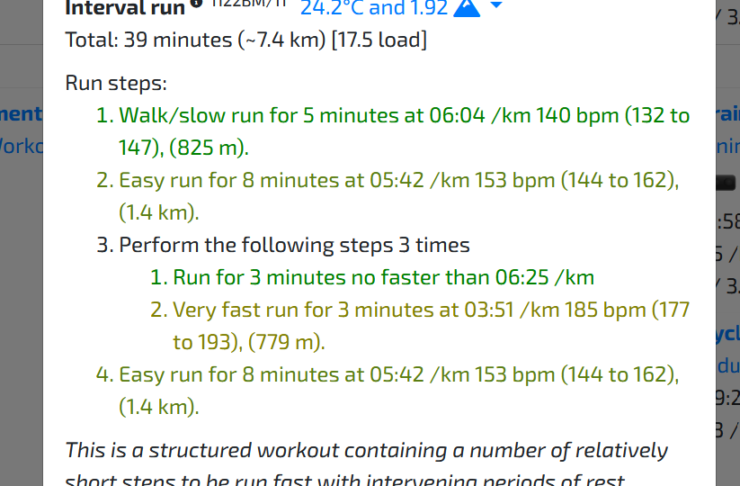
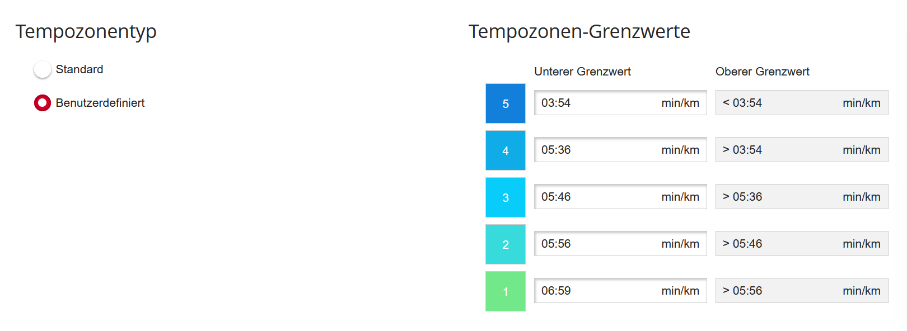
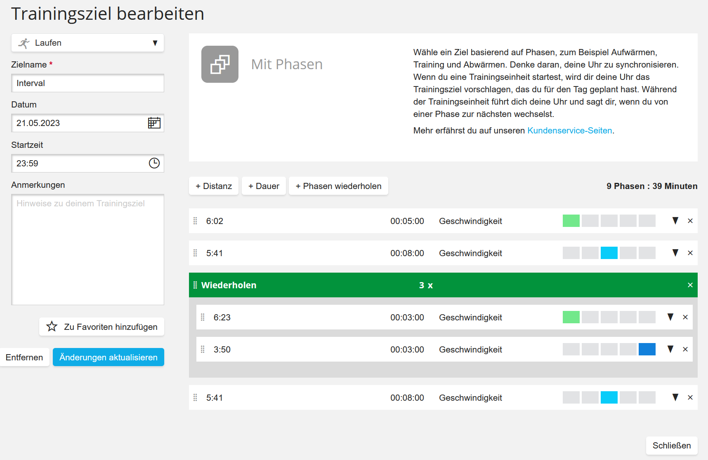

# TrainOnPolar
Imports [TrainAsOne](trainasone.com) workouts into [Polar Flow](flow.polar.com)

This is a work in progress and kind of proof-of-concept level quality right now.
Thinks might break if your settings are different from mine,
feedback is greatly appreciated :)

# Functionality

TrainOnPolar will download the upcoming workout from [TrainAsOne](trainasone.com),
like this:

Optionally, custom pace zones will be set in [Polar Flow](flow.polar.com).
I'm using a [stryd](stryd.com) foot pod for better pace stability,
training with pace zones might be a bit more challenging or annoying 
with the watch only.
Right now the zones are too narrow even for the stryd,
this is an area I'm currently experimenting with and there will be changes shortly.

Finally, the workout is imported into [Polar Flow](flow.polar.com)
as a phased target. The phases are named according to the target speed,
which will be shown on the phased workout screen of the watch during the workout.

# Watch setup

Unfortunately, there is currently no polar watch that can show
the average speed of a phase during a phased workout,
and as mentioned above training with real pace and pace zones might be challenging.

I currently have my watch setup in such a way that the first training view
contains *current pace (zone pointer)*, *current lap pace*, and *lap time*.

In this way, I can quickly switch between the phased workout screen,
which shows my target pace and remaining time in the phase,
as well as my first screen, which shows my average pace in the current lap.
Seeing the lap time here helps because I don't have to switch
back and forth all the time.

Unfortunately, this requires me to take a manual lap
every time a new phase starts.
I don't see a better option with the data fields that polar provides.
On models that support it, the slap gesture comes in handy for lap taking,
as it also works on the phased workout screen,
where the red button is used to alter the workout on the fly.

# Setting up TrainOnPolar

TrainOnPolar is a python script,
that as of now needs to be run manually for each import.
In the future I will likely add a way to let it run periodically in the background.

You will need:
- to install the [python](python.org) programming language on your computer
- `git clone` or download this repository
- optionally create a virtual environment to install dependencies in:
    - `python -m venv env`
    - `./env/Scripts/activate` on Windows or `./env/bin/activate` on MacOS/Linux
- install the dependencies with `pip install -r requirements.txt`
- copy the file `config.ini.example` to `config.ini` and
enter your login details.
- run the script with `python ./main.py`

# Zone settings

These are due to change shortly.
- change zones: change to `yes` to enable automatic setting of pace zones
- others: settings from the top of the pace zone dialog in polar flow. As of now I haven't checked
  which other values are possible.
- mas: maximal aerobic speed. I believe this is the same as the vVO2max
that TrainAsOne provides in the charts tab, so I'm using that value.

